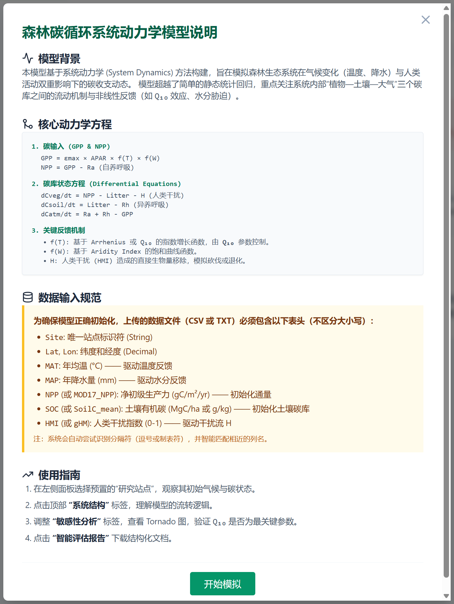
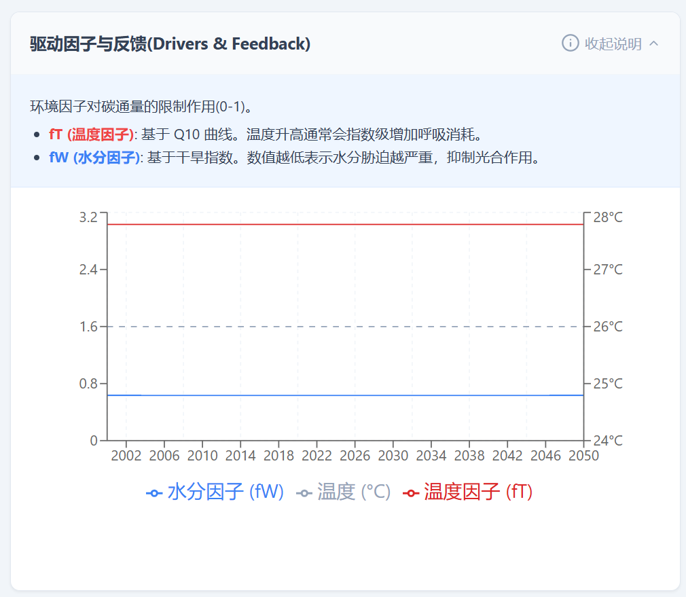
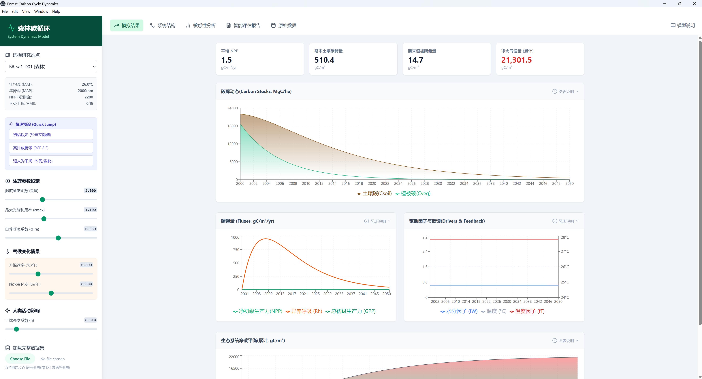
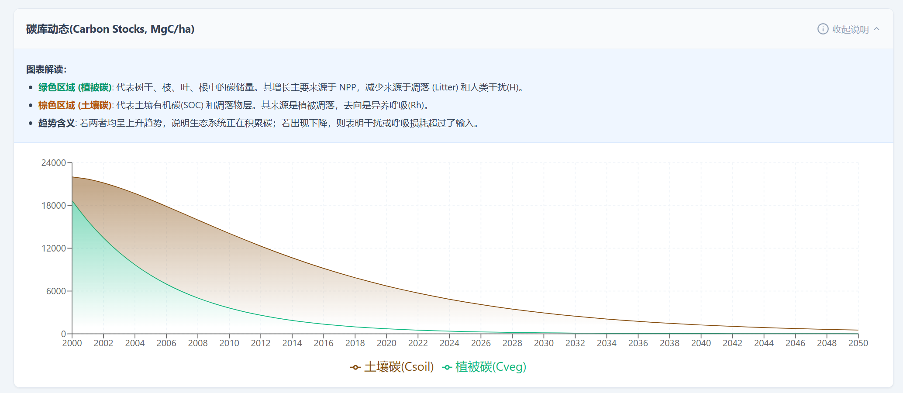
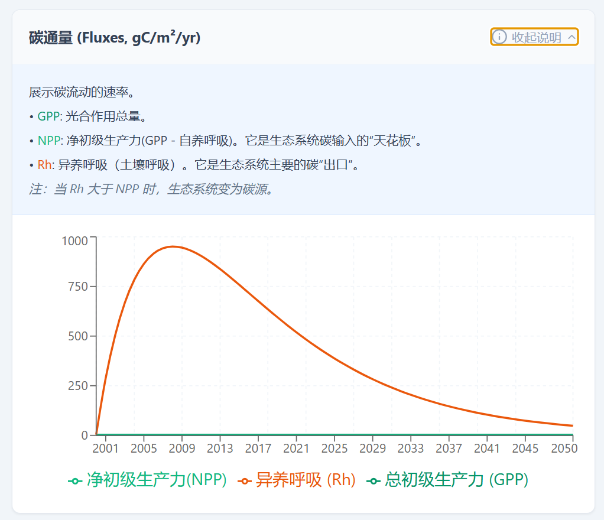
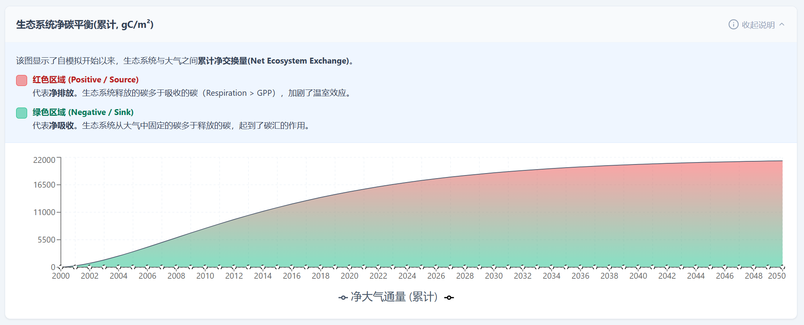
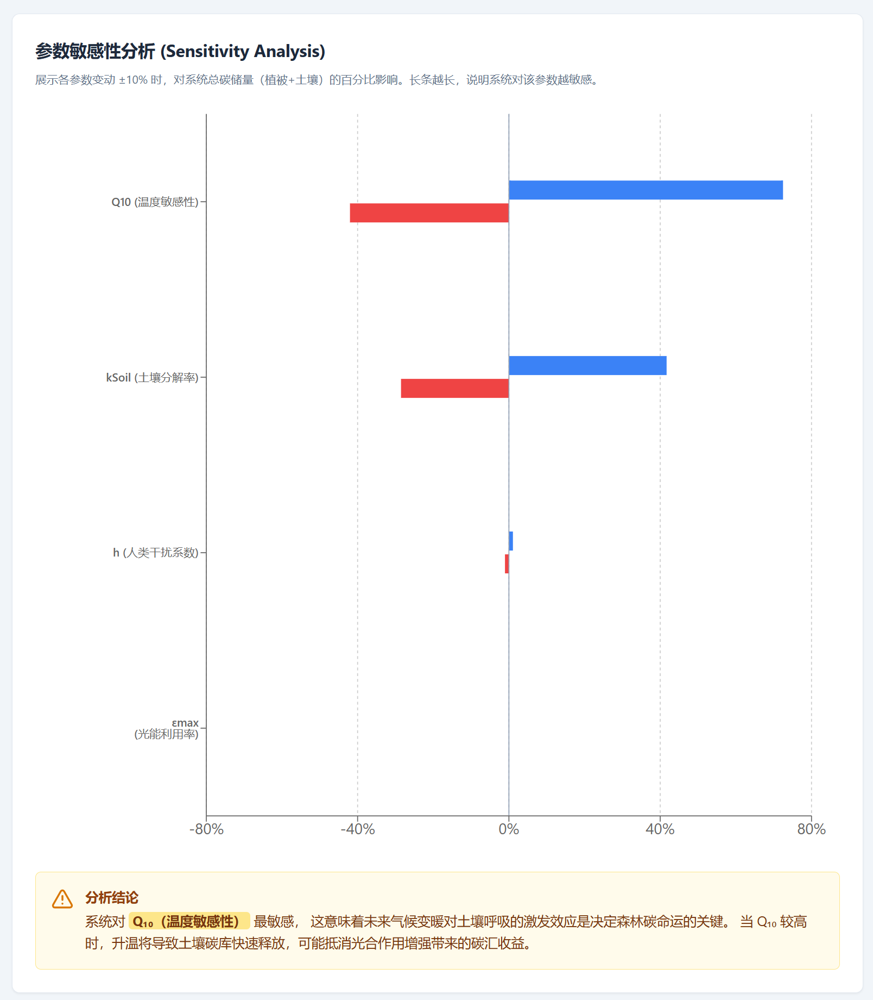
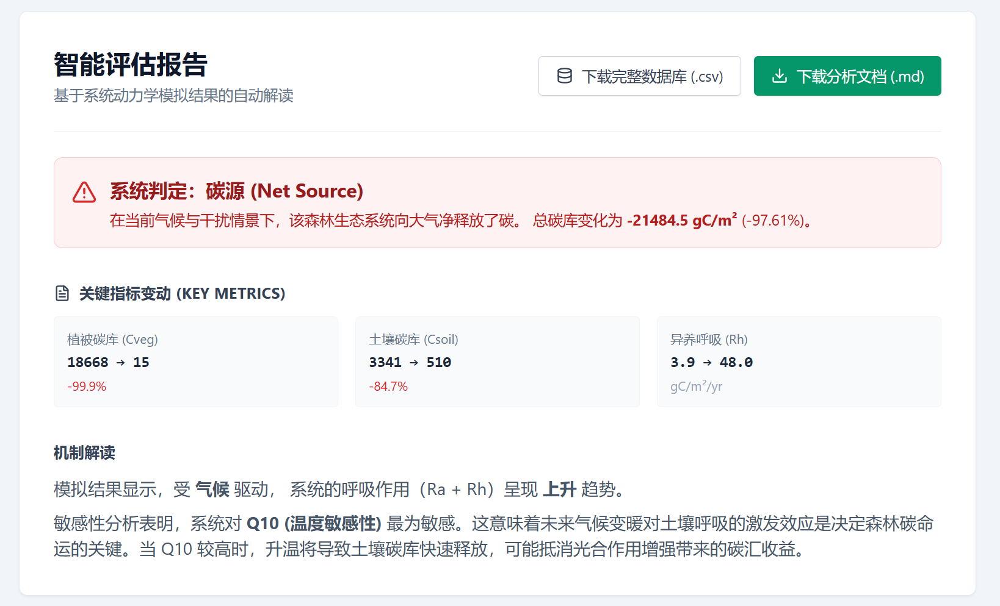

# 森林碳循环动态模拟系统：理论基础、设计实现与应用分析
# Forest Carbon Cycle Dynamic Simulation System: Theory, Implementation, and Application

[](https://creativecommons.org/licenses/by-nc/4.0/)

**摘要 (Abstract)**

在全球气候变化背景下，准确评估森林生态系统的碳汇功能对于制定气候缓解策略至关重要。本文详细阐述了一款基于系统动力学（System Dynamics）原理的森林碳循环动态模拟系统的设计与实现。该系统采用现代 Web 技术栈（React + TypeScript）构建，集成了数值积分求解器与交互式可视化引擎。通过耦合光合作用、呼吸作用及土壤碳周转过程，系统能够定量模拟不同气候情景（如升温、干旱）对森林碳收支的长期影响。本文将从理论模型、数学表征、核心算法、系统架构及模拟结果五个维度进行深入剖析。

---

## 1. 理论模型与数学表征 (Theoretical Framework)

本模型属于基于过程（Process-Based）的陆地生态系统碳循环模型。模型将森林生态系统抽象为由大气、植被、土壤构成的碳循环网络，旨在模拟森林生态系统在气候变化（升温、降水改变）和人类活动（砍伐、土地利用变化）双重压力下的碳收支动态。

### 1.1 核心假设与系统边界
1.  **质量守恒**：碳在大气、植被和土壤三大碳库之间转移，遵循质量守恒定律。
2.  **非线性反馈**：生理过程（如呼吸作用）对温度的响应遵循 Arrhenius 指数规律（$Q_{10}$ 效应）。
3.  **初始锚定**：模拟的时间起点基于站点的实测数据（如 $SOC$, $NPP$）进行初始化。

### 1.2 核心控制方程 (Governing Equations)

系统的动态演化由一组常微分方程（ODEs）描述。

**方程 1：植被碳库动力学 ($C_{veg}$)**

$$
\frac{dC_{veg}}{dt} = NPP(t) - Litter(t) - H(t)
$$

其中，$NPP = GPP - R_a$ 为净初级生产力，$Litter$ 为凋落物输入，$H$ 为人类干扰造成的碳移除。

**方程 2：土壤碳库动力学 ($C_{soil}$)**

$$
\frac{dC_{soil}}{dt} = Litter(t) - Rh(t)
$$

其中，$R_h$ 为异养呼吸（土壤呼吸），受温度与土壤湿度的非线性调控。


*图 1：模型内部结构说明。展示了碳输入（光合作用）、碳周转（凋落物）与碳输出（呼吸作用）的数学逻辑关系。*

### 1.3 关键生态过程算法

#### A. 光合作用 (GPP)
采用光能利用率 (LUE) 模型的变体，引入环境限制函数：

$$
GPP(t) = \varepsilon_{max} \times APAR_{base} \times f(T_t) \times f(W_t)
$$

*   $\varepsilon_{max}$: 最大光能利用率。
*   $APAR_{base}$: 基准光合有效辐射。
*   $f(T_t)$: 温度限制因子。
*   $f(W_t)$: 水分限制因子。

#### B. 呼吸作用 (Ra & Rh)
生态系统的呼吸作用对温度的变化表现出非线性正反馈，采用经典的 $Q_{10}$ 指数方程：

$$
R(t) = k \cdot C(t) \cdot Q_{10}^{\frac{T(t) - T_{ref}}{10}} \cdot f(W_t)
$$

该公式表明，温度每升高 10°C，呼吸速率将增加 $Q_{10}$ 倍。


*图 2：系统驱动因子与反馈机制示意图。展示了温度、水分等环境变量如何通过光合作用（GPP）与呼吸作用（Rh, Ra）控制碳在植被与土壤库之间的流动。*

---

## 2. 系统架构与实现 (System Architecture & Implementation)

本系统采用“浏览器即模型（Browser-as-Model）”架构，无需本地部署即可提供模拟能力。

### 2.1 技术栈与目录结构
系统核心采用 **TypeScript** 编写，利用其静态类型系统确保物理量计算的量纲一致性。前端框架选用 **React 18**，配合 **Vite** 构建工具。

**项目目录结构：**
```text
forest-carbon-cycle-dynamics/
├── components/            # 视图层 (View Layer)
│   ├── Charts.tsx         # Recharts 时间序列可视化组件
│   ├── ControlPanel.tsx   # 参数控制面板
│   ├── Dashboard.tsx      # 主仪表盘容器
│   ├── SensitivityAnalysis.tsx # 敏感性分析视图
│   ├── SimulationReport.tsx    # 智能报告生成器
│   └── StockFlowDiagram.tsx    # SVG 系统动力学流图
├── services/              # 业务逻辑与计算服务 (Model Layer)
│   ├── dataService.ts     # 数据加载与预处理
│   ├── exportService.ts   # 结果导出
│   └── modelService.ts    # 核心 ODE 求解器与通量计算引擎
├── types.ts               # TypeScript 类型定义
└── App.tsx                # 应用入口
```

### 2.2 界面布局
系统界面设计主要由控制面板、动态可视化区和指标监控区构成。


*图 3：系统主界面概览。左侧为参数控制面板，右侧展示了碳库动态与碳通量的时间序列变化，顶部卡片实时显示当前模拟年份的关键生态指标。*

### 2.3 核心算法代码解析

#### 2.3.1 反演初始化 (Inverse Initialization)
为了解决动态模型常面临的“预热效应”，本系统利用 $t_0$ 时刻的观测数据反向求解系统的内禀参数。

```typescript
// services/modelService.ts 片段

// 计算初始时刻的环境标量
const initial_fT = calc_fT(site.MAT, params.Q10);
const initial_fW = calc_fW(site.AridityIndex);

// 反演基准 APAR：确保模拟起点的 GPP 等于观测值
const baseline_APAR = site.GPP / (params.epsilonMax * initial_fT * initial_fW);
```

#### 2.3.2 前向欧拉积分 (Forward Euler Integration)
系统采用前向欧拉法对微分方程进行数值求解，时间步长 $\Delta t = 1$ 年。

```typescript
// 状态变量迭代更新
for (let t = 0; t <= simulationYears; t++) {
    // 1. 更新驱动力
    const currentTemp = site.MAT + (params.warmingRate * t);
    
    // 2. 计算通量速率
    const Rh = params.kSoil * Csoil * fT * fW; // 异养呼吸
    const NPP = GPP - Ra;                      // 净初级生产力
    
    // 3. 求解微分方程
    const dCsoil = Litter - Rh;
    
    // 4. 欧拉积分
    Csoil += dCsoil; 
}
```

---

## 3. 模拟结果与分析 (Simulation Results)

系统模拟了未来 50-100 年内森林生态系统在不同气候情景下的演变趋势。

### 3.1 碳库动态演变
在标准气候情景下，系统模拟了植被碳库与土壤碳库的长期积累过程。模拟结果显示，随着林龄增加，植被碳库呈现逻辑斯蒂（Logistic）增长，最终趋于饱和。


*图 4：森林碳库动态模拟结果。绿色曲线代表植被碳密度，棕色曲线代表土壤碳密度。*

### 3.2 碳通量与源汇转换
碳通量（Carbon Fluxes）是衡量生态系统代谢活性的关键指标。


*图 5：生态系统碳通量时间序列。展示了 GPP（总初级生产力）、NPP（净初级生产力）与 Rh（异养呼吸）随时间的动态变化。*

### 3.3 净生态系统碳平衡 (NECB)
净生态系统碳平衡（NECB）反映了森林是作为“碳汇”还是“碳源”。

$$
NECB = NEP - Disturbance_{loss}
$$

模拟显示，在升温情景下，由于呼吸作用对温度的敏感性（$Q_{10}$ 效应）高于光合作用，森林可能在特定阈值后由碳汇转变为碳源。


*图 6：生态系统净碳平衡（NECB）分析。正值表示碳汇，负值表示碳源。*

---

## 4. 敏感性分析与智能评估 (Sensitivity Analysis & Assessment)

### 4.1 参数敏感性
结果表明，土壤呼吸对 $Q_{10}$ 参数高度敏感，微小的温度上升可能导致土壤碳库的损耗。


*图 7：参数敏感性分析结果。展示了不同 $Q_{10}$ 值对生态系统总碳储量的影响。*

### 4.2 智能评估报告
系统集成了自动化的报告生成模块，能够根据模拟结果自动生成综合评估报告。


*图 8：系统生成的智能评估报告示例。*

---

## 5. 结论 (Conclusion)

本文介绍的森林碳循环动态模拟系统，通过集成系统动力学方法与现代 Web 技术，实现了一个可交互的虚拟生态实验室。模拟结果强调了温度升高对森林碳汇功能的双重影响：一方面延长生长季可能促进光合作用，另一方面指数级增长的呼吸消耗可能抵消固碳收益。本系统为森林管理者制定适应性管理措施提供了定量的科学依据。

---

## 6. 许可协议 (License)

本项目采用 **[Creative Commons Attribution-NonCommercial 4.0 International License (CC BY-NC 4.0)](https://creativecommons.org/licenses/by-nc/4.0/)** 进行许可。

这意味着您可以：
*   **共享** — 在任何媒介或格式下复制和分发本素材。
*   **改编** — 基于本素材进行修改、转换或构建。

但在遵守以下条件的前提下：
*   **署名 (Attribution)** — 您必须给出适当的署名，提供指向本许可协议的链接，同时标明是否（对原始作品）作了修改。
*   **非商业性使用 (NonCommercial)** — 您不得将本素材用于商业目的。

如需商业使用授权，请联系作者。
